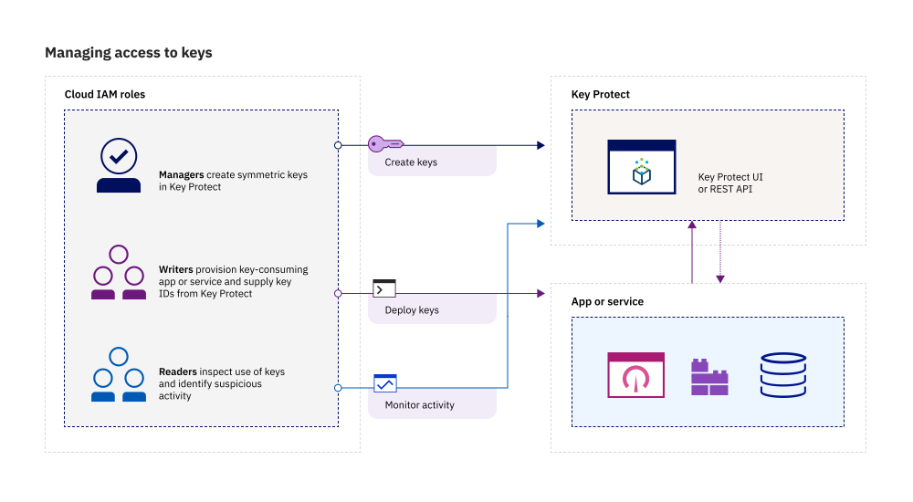

---

copyright:
  years: 2017, 2020
lastupdated: "2020-03-31"

keywords: key management service, KMS, about Key Protect, about KMS, Key Protect use cases, KMS use cases

subcollection: key-protect

---

{:shortdesc: .shortdesc}
{:screen: .screen}
{:pre: .pre}
{:table: .aria-labeledby="caption"}
{:external: target="_blank" .external}
{:codeblock: .codeblock}
{:tip: .tip}
{:note: .note}
{:important: .important}
{:term: .term}

# Service overview
{: #about}

{{site.data.keyword.keymanagementservicefull}} helps you provision encrypted keys for apps across {{site.data.keyword.cloud_notm}} services. As you manage the lifecycle of your keys, you can benefit from knowing that your keys are secured by FIPS 140-2 Level 3 certified cloud-based hardware security modules (HSMs) that protect against the theft of information.
{: shortdesc}

## Reasons to use {{site.data.keyword.keymanagementserviceshort}}
{: #use-cases}

You might need to manage keys in the following scenarios:

| Scenarios | Reasons|
| --- | ---- |
| As an IT admin for a large corporation, you need to integrate, track, and rotate encryption keys for many different service offerings. | The {{site.data.keyword.keymanagementserviceshort}} interface simplifies the management of multiple encryption services. With the service, you can manage and sort encryption keys in one centralized location, or you can separate keys by project and house them in different {{site.data.keyword.cloud_notm}} spaces. |
| As a developer, you want to integrate your pre-existing applications, such as self-encrypting storage, to {{site.data.keyword.keymanagementserviceshort}}. | Apps on or outside {{site.data.keyword.cloud_notm}} can integrate with the {{site.data.keyword.keymanagementserviceshort}} APIs. You can use your own existing keys for your apps. |
| Your development team has stringent policies, and you need a way to generate and rotate keys every 30 days. | With {{site.data.keyword.keymanagementserviceshort}}, you can rapidly generate keys from an {{site.data.keyword.cloud_notm}} hardware security module (HSM). When it's time to replace a key, you can [rotate the key on-demand](/docs/key-protect?topic=key-protect-rotate-keys) or [set a rotation policy](/docs/key-protect?topic=key-protect-set-rotation-policy) for the key to meet your on-going security needs. |
| You are a security admin in an industry, such as finance or legal, that must adhere to governance over how data is protected. You need to grant controlled access of keys without compromising the data that it secures. | With the service, you can control user access to manage keys by [assigning different Identity and Access Management roles](/docs/key-protect?topic=key-protect-manage-access#roles). For example, you can grant read-only access to users who need to view key creation information without viewing the key material. |
| You want to perform envelope encryption as you move data into the cloud. You need to bring your own master encryption keys, so you can manage and protect other keys that encrypt your data at rest. | With {{site.data.keyword.keymanagementserviceshort}}, you can [wrap (encrypt) your data encryption keys with a highly secure root key](/docs/key-protect?topic=key-protect-envelope-encryption). You can bring your own root keys or create them in the service.|

Looking for a dedicated key management solution that supports customer-controlled, cloud-based hardware security modules (HSMs)? [{{site.data.keyword.cloud_notm}} {{site.data.keyword.hscrypto}}](/docs/hs-crypto?topic=hs-crypto-get-started) integrates with {{site.data.keyword.keymanagementserviceshort}} to enable Keep Your Own Keys (KYOK) for {{site.data.keyword.cloud_notm}}, so your organization has more control and authority over its data. Check out the <a href="https://{DomainName}/catalog/services/hyper-protect-crypto-services" target="_blank" class="external">{{site.data.keyword.hscrypto}} offering details page</a> to learn more.
{: tip}

## How {{site.data.keyword.keymanagementserviceshort}} works
{: #kp-how}

{{site.data.keyword.keymanagementservicelong_notm}} helps you manage encryption keys throughout your organization by aligning with {{site.data.keyword.cloud_notm}} Identity and Access Management (IAM) roles.

An IT or security admin needs advanced permissions that an auditor might not. To simplify access, {{site.data.keyword.keymanagementserviceshort}} maps to {{site.data.keyword.cloud_notm}} Identity and Access Management roles so that each role has a different view of the service. To help guide which view and level of access best suits your needs, see [Managing users and access](/docs/key-protect?topic=key-protect-manage-access#roles).

The following diagram shows how managers, readers, and writers can interact with keys that are managed in the service.

<dl>
  <dt>Service integration</dt>
    <dd>Managers for your {{site.data.keyword.keymanagementserviceshort}} service instance
manage the keys for cryptography.</dd>
  <dt>Audits</dt>
    <dd>Readers access a high-level view of keys and identify suspicious activities.</dd>
  <dt>Apps</dt>
    <dd>Writers manage the keys for the cryptography that they code into apps.</dd>
</dl>

{: caption="Figure 1. Shows how different access roles interact with keys." caption-side="bottom"}
