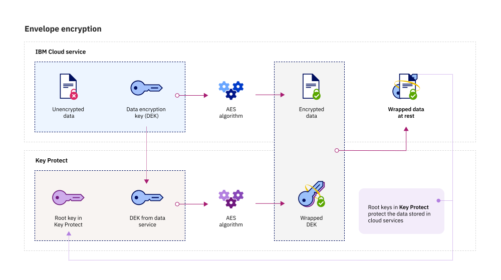
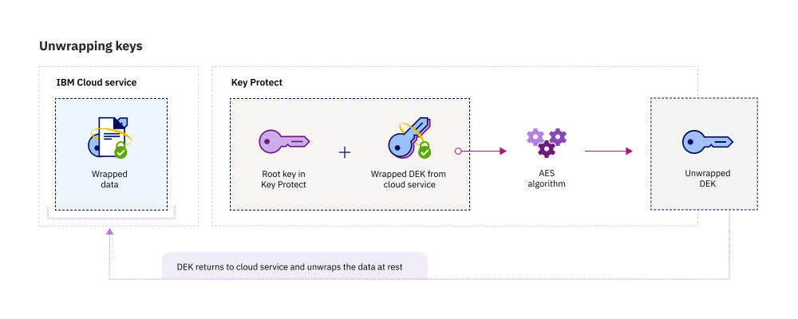

---

copyright:
  years: 2017, 2020
lastupdated: "2020-03-19"

keywords: data-at-rest encryption, envelope encryption, root key, data encryption key, protect data encryption key, encrypt data encryption key, wrap data encryption key, unwrap data encryption key

subcollection: key-protect

---

{:shortdesc: .shortdesc}
{:screen: .screen}
{:pre: .pre}
{:table: .aria-labeledby="caption"}
{:external: target="_blank" .external}
{:codeblock: .codeblock}
{:tip: .tip}
{:note: .note}
{:important: .important}
{:term: .term}

# Protecting data with envelope encryption
{: #envelope-encryption}

Envelope encryption is the practice of encrypting data with a data encryption
key (DEK) and then encrypting the DEK with a root key that you can fully manage.
{: shortdesc}

{{site.data.keyword.keymanagementservicefull}} protects your stored data with
advanced encryption and offers several benefits:

| Benefit | Description |
| --- | --- |
| Customer-managed encryption keys | With the service, you can provision root keys to protect the security of your encrypted data in the cloud. Root keys serve as master key-wrapping keys, which help you manage and safeguard the data encryption keys (DEKs) provisioned in {{site.data.keyword.cloud_notm}} data services. You decide whether to import your existing root keys, or have {{site.data.keyword.keymanagementserviceshort}} generate them on your behalf. |
| Confidentiality and integrity protection | {{site.data.keyword.keymanagementserviceshort}} uses the Advanced Encryption Standard (AES) algorithm in Galois/Counter Mode (GCM) to protect keys. When you create keys in the service, {{site.data.keyword.keymanagementserviceshort}} generates them within the trust boundary of {{site.data.keyword.cloud_notm}} hardware security modules (HSMs), so only you have access to your encryption keys. |
| Cryptographic shredding of data | If your organization detects a security issue, or your app no longer needs a set of data, you can choose to shred the data permanently from the cloud. When you delete a root key that protects other DEKS, you ensure that the keys' associated data can no longer be accessed or decrypted. |
| Delegated user access control | {{site.data.keyword.keymanagementserviceshort}} supports a centralized access control system to enable granular access for your keys. [By assigning IAM user roles and advanced permissions](/docs/key-protect?topic=key-protect-manage-access#roles), security admins decide who can access which root keys in the service. |
{: caption="Table 1. Describes the benefits of customer-managed encryption" caption-side="top"}

## How it works
{: #overview}

Envelope encryption combines the strength of multiple encryption algorithms to
protect your sensitive data in the cloud. It works by wrapping one or more data
encryption keys (DEKs) with advanced encryption by using a root key that you can
fully manage.

This key wrapping process creates wrapped DEKs that protect your stored data
from unauthorized access or exposure. Unwrapping a DEK reverses the envelope
encryption process by using the same root key, resulting in decrypted and
authenticated data.

The following diagram shows a contextual view of the key wrapping functionality.

{: caption="Figure 1. Contextual view of envelope encryption." caption-side="bottom"}

Envelope encryption is treated briefly in the NIST Special Publication 800-57,
Recommendation for Key Management. To learn more, see
[NIST SP 800-57 Pt. 1 Rev. 4.](https://www.nist.gov/publications/recommendation-key-management-part-1-general-0){: external}

## Key types
{: #key-types}

The service supports two key types, root keys and standard keys, for the
advanced encryption and management of data.

<dl>
  <dt>
    Root keys
  </dt>
  <dd>
    

      Root keys are primary resources in
      {{site.data.keyword.keymanagementserviceshort}}. They are symmetric
      key-wrapping keys used as roots of trust for wrapping (encrypting) and
      unwrapping (decrypting) other keys stored in a data service.
    

    

      With {{site.data.keyword.keymanagementserviceshort}}, you can create,
      store, and manage the lifecycle of root keys to achieve full control of
      other keys stored in the cloud. Unlike a standard key, a root key can
      never leave the bounds of the
      {{site.data.keyword.keymanagementserviceshort}} service.
    

  </dd>

  <dt>
    Standard keys
  </dt>
  <dd>
    Standard keys are a way to persist a secret, such as a password or an
    encryption key. When you use
    {{site.data.keyword.keymanagementserviceshort}} to store standard keys,
    you enable hardware security module (HSM) storage for your secrets,
    fine-grained access control to your resources with
    [{{site.data.keyword.iamshort}} (IAM)](/docs/key-protect?topic=key-protect-manage-access),
    and the ability to audit API calls to the service with
    [{{site.data.keyword.cloudaccesstrailshort}}](/docs/key-protect?topic=key-protect-at-events).
  </dd>
</dl>

After you create keys in {{site.data.keyword.keymanagementserviceshort}}, the
system returns an ID value that you can use to make API calls to the service.
You can retrieve the ID value for your keys from the
{{site.data.keyword.keymanagementserviceshort}} dashboard or by using the
[{{site.data.keyword.keymanagementserviceshort}} API](https://{DomainName}/apidocs/key-protect){: external}.

## Wrapping keys
{: #wrapping}

Root keys help you group, manage, and protect data encryption keys (DEKs) stored
in the cloud. You can wrap one or more DEKs with advanced encryption by
designating a root key in {{site.data.keyword.keymanagementserviceshort}} that
you can fully manage.

After you designate a root key in
{{site.data.keyword.keymanagementserviceshort}}, you can send a key wrap request
to the service by using the {{site.data.keyword.keymanagementserviceshort}} API.
The key wrap operation provides both confidentiality and integrity protection
for a DEK.

The following diagram shows the key wrapping process in action:

{: caption="Figure 2. Key wrapping in action." caption-side="bottom"}

The following table describes the inputs needed to perform a key wrap operation:

| Input | Description |
| --- | --- |
| Root key ID | The ID value for the root key that you want to use for wrapping. The root key can be imported into the service, or it can originate in {{site.data.keyword.keymanagementserviceshort}} from its HSMs. Root keys that are used for wrapping must be 128, 192, or 256 bits so that a wrap request can succeed. |
| Plaintext | Optional: The data encryption key (DEK) that you want to use for data encryption. This value must be base64 encoded. To generate a new DEK, you can omit the `plaintext` property. {{site.data.keyword.keymanagementserviceshort}} generates a random plaintext (32 bytes) that is rooted in an HSM and then wraps that value. |
| Additional authentication data (AAD) | Optional: An array of strings that checks the integrity of the key contents. Each string can hold up to 255 characters. If you supply AAD during a wrap request, you must specify the same AAD during the subsequent unwrap request. |
{: caption="Table 2. Inputs required for key wrapping in {{site.data.keyword.keymanagementserviceshort}}" caption-side="top"}

If you send a wrap request without specifying the plaintext to encrypt, the
AES-GCM encryption algorithm generates and converts a plaintext to an
unintelligible form of data called a ciphertext. This process outputs a 256-bit
DEK with new key material.

The system then uses an AES key-wrapping algorithm, which wraps the DEK and its
key material with the specified root key. A successful wrap operation returns a
base64 encoded wrapped DEK that you can store in an
{{site.data.keyword.cloud_notm}} app or service.

## Unwrapping keys
{: #unwrapping}

Unwrapping a data encryption key (DEK) decrypts and authenticates the contents
within the key, returning the original key material to your data service.

If your business application needs to access the contents of your wrapped DEKs,
you can use the {{site.data.keyword.keymanagementserviceshort}} API to send an
unwrap request to the service. To unwrap a DEK, you specify the ID value of the
root key and the `ciphertext` value returned during the initial wrap request. To
complete the unwrap request, you must also supply the additional authenticated
data (AAD) to check the integrity of the key contents.

The following diagram shows key unwrapping in action.

{: caption="Figure 3. Key unwrapping in action." caption-side="bottom"}

After you send the unwrap request, the system reverses the key wrapping process
by using the same AES algorithms. A successful unwrap operation returns the
base64 encoded `plaintext` value to your {{site.data.keyword.cloud_notm}} data
at rest service.
