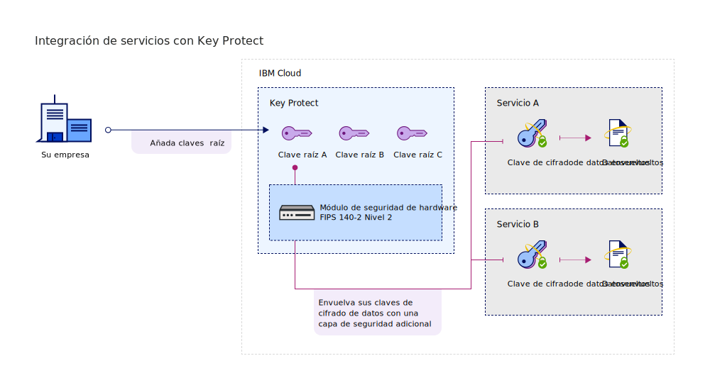

---

copyright:
  years: 2017, 2019
lastupdated: "2019-07-09"

keywords: Key Protect integration, integrate service with Key Protect

subcollection: key-protect

---

{:shortdesc: .shortdesc}
{:screen: .screen}
{:pre: .pre}
{:table: .aria-labeledby="caption"}
{:external: target="_blank" .external}
{:codeblock: .codeblock}
{:tip: .tip}
{:note: .note}
{:important: .important}

# Integración de servicios
{: #integrate-services}

{{site.data.keyword.keymanagementservicefull}} se integra con las soluciones de datos y almacenamiento para ayudarle a traer y gestionar su propio cifrado en la nube.
{: shortdesc}

[Después de crear una instancia de un servicio](/docs/services/key-protect?topic=key-protect-provision), puede integrar {{site.data.keyword.keymanagementserviceshort}} con los siguientes servicios soportados:

| Servicio | Descripción |
| --- | --- |
| {{site.data.keyword.cos_full_notm}} | Añada [cifrado de sobre](/docs/services/key-protect?topic=key-protect-envelope-encryption) a sus depósitos de almacenamiento utilizando {{site.data.keyword.keymanagementserviceshort}}. Utilice claves raíz que gestiona en {{site.data.keyword.keymanagementserviceshort}} para proteger las claves de cifrado de datos que cifran los datos en reposo. Para obtener más información, consulte [Integración con {{site.data.keyword.cos_full_notm}}](/docs/services/key-protect?topic=key-protect-integrate-cos).|
| {{site.data.keyword.databases-for-postgresql_full_notm}} | Proteja sus bases de datos asociando claves raíz a su despliegue de {{site.data.keyword.databases-for-postgresql}}. Para obtener más información, consulte la [documentación de {{site.data.keyword.databases-for-postgresql}}](/docs/services/databases-for-postgresql?topic=cloud-databases-key-protect).|
| {{site.data.keyword.cloudant_short_notm}} for {{site.data.keyword.cloud_notm}} ({{site.data.keyword.cloud_notm}} Dedicado) | Refuerce la estrategia de cifrado en reposo asociando claves raíz a la instancia de hardware dedicado de {{site.data.keyword.cloudant_short_notm}}. Para obtener más información, consulte la [documentación de {{site.data.keyword.cloudant_short_notm}}](/docs/services/Cloudant/offerings?topic=cloudant-security#secure-access-control). |
| {{site.data.keyword.containerlong_notm}} | Utilice el [cifrado de sobre](/docs/services/key-protect?topic=key-protect-envelope-encryption) para proteger secretos en el clúster de {{site.data.keyword.containershort_notm}}. Para obtener más información, consulte [Cifrado de secretos de Kubernetes mediante {{site.data.keyword.keymanagementserviceshort}} ](/docs/containers?topic=containers-encryption#keyprotect).|
{: caption="Tabla 1. Describe las integraciones disponibles con {{site.data.keyword.keymanagementserviceshort}}" caption-side="top"}

## Comprensión de la integración 
{: #understand-integration}

Cuando integra un servicio con soporte con {{site.data.keyword.keymanagementserviceshort}}, habilita el [cifrado de sobre](/docs/services/key-protect?topic=key-protect-envelope-encryption) de dicho servicio. Esta integración le permite utilizar una clave raíz que almacena en {{site.data.keyword.keymanagementserviceshort}} para envolver las claves de cifrado de datos que cifran los datos en reposo. 

Por ejemplo, puede crear una clave raíz, gestionar la clave en {{site.data.keyword.keymanagementserviceshort}} y utilizar la clave raíz para proteger los datos que se almacenan en distintos servicios en la nube.

### Métodos de API de {{site.data.keyword.keymanagementserviceshort}}
{: #envelope-encryption-api-methods}

De forma transparente para el usuario, la API de {{site.data.keyword.keymanagementserviceshort}} lleva a cabo el proceso de cifrado del sobre.  

En la tabla siguiente se listan los métodos API que añaden o eliminan el cifrado de sobre en un recurso.

| Método | Descripción |
| --- | --- |
| `POST /keys/{ID_clave_raíz}?action=wrap` | [Envuelve (cifra) una clave de cifrado de datos](/docs/services/key-protect?topic=key-protect-wrap-keys) |
| `POST /keys/{ID_clave_raíz}?action=unwrap` | [Desenvuelve (descifra) una clave de cifrado de datos](/docs/services/key-protect?topic=key-protect-unwrap-keys) |
{: caption="Tabla 2. Describe los métodos API de {{site.data.keyword.keymanagementserviceshort}}" caption-side="top"}

Para obtener más información sobre la gestión de claves mediante programación en {{site.data.keyword.keymanagementserviceshort}}, consulte la [documentación de consulta de la API de {{site.data.keyword.keymanagementserviceshort}}](https://{DomainName}/apidocs/key-protect){: external}.
{: tip}

## Integración de un servicio con soporte
{: #grant-access}

Para añadir una integración, cree una autorización entre los servicios utilizando el panel de control de {{site.data.keyword.iamlong}}. Las autorizaciones habilitan las políticas de acceso de servicio a servicio, de modo que pueda asociar un recurso en su servicio de datos en la nube con una [clave raíz](/docs/services/key-protect?topic=key-protect-envelope-encryption#key-types) que gestiona en {{site.data.keyword.keymanagementserviceshort}}.

Asegúrese de proporcionar los servicios en la misma región antes de crear una autorización. Para obtener más información sobre las autorizaciones de servicio, consulte [Concesión de acceso entre servicios](/docs/iam?topic=iam-serviceauth){: external}.
{: note}

Cuando esté listo para integrar un servicio, utilice los pasos siguientes para crear una autorización:

1. En la barra de menús, pulse **Gestionar** &gt; **Seguridad** &gt; **Acceso (IAM)** y seleccione **Autorizaciones**. 
2. Pulse **Crear**.
3. Seleccione un servicio de origen y uno de destino para la autorización.
 
  Para **Servicio de origen**, seleccione el servicio de datos en la nube que desea integrar con {{site.data.keyword.keymanagementserviceshort}}. Para **Servicio de destino**, seleccione **{{site.data.keyword.keymanagementservicelong_notm}}**.

5. Habilite el rol **Lector**.

    Con los permisos de _Lector_, su servicio de origen puede examinar las claves raíz suministradas en la instancia especificada de {{site.data.keyword.keymanagementserviceshort}}.

6. Pulse **Autorizar**.

## Qué hacer a continuación
{: #integration-next-steps}

Agregue el cifrado avanzado a sus recursos de nube creando una clave raíz en {{site.data.keyword.keymanagementserviceshort}}. Agregue un nuevo recurso a un servicio de datos en la nube soportado y seleccione la clave raíz que desea utilizar para el cifrado avanzado.

- Para obtener más información sobre la creación de claves raíz con el servicio de {{site.data.keyword.keymanagementserviceshort}}, consulte [Creación de claves raíz](/docs/services/key-protect?topic=key-protect-create-root-keys).
- Para obtener más información acerca de traer sus propias claves raíz al servicio de {{site.data.keyword.keymanagementserviceshort}}, consulte [Importación de claves raíz](/docs/services/key-protect?topic=key-protect-import-root-keys).

